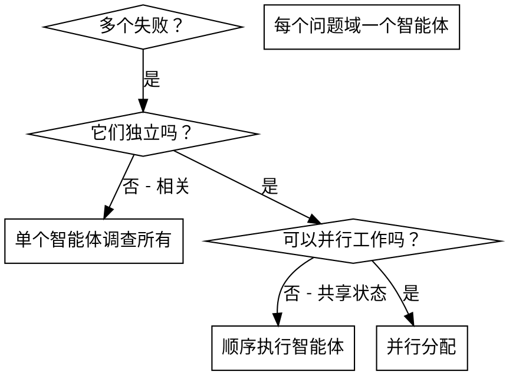

# 并行分配子智能体

## 概述

你将任务委托给具有独立上下文的专业化智能体。通过精确设计它们的指令和上下文，你可以确保它们保持专注并成功完成任务。它们永远不应该继承你的会话上下文或历史记录——你要精确构建它们所需的内容。这也保护了你自己的上下文用于协调工作。

当你有多个不相关的失败（不同的测试文件、不同的子系统、不同的 bug）时，顺序调查它们是浪费时间。每个调查都是独立的，可以并行进行。

**核心原则：** 为每个独立问题域分配一个智能体。让它们并发工作。

## 何时使用



**使用场景：**
- 3个或更多测试文件失败，根因不同
- 多个子系统独立损坏
- 每个问题可以在不需要其他问题上下文的情况下理解
- 调查之间无共享状态

**不使用场景：**
- 失败相关（修复一个可能修复其他）
- 需要理解完整系统状态
- 智能体会相互干扰

## 模式

### 1. 识别独立域

按损坏内容对失败进行分组：
- 文件 A 测试：工具审批流程
- 文件 B 测试：批量完成行为
- 文件 C 测试：中止功能

每个域都是独立的——修复工具审批不会影响中止测试。

### 2. 创建专注的智能体任务

每个智能体获得：
- **明确范围：** 一个测试文件或子系统
- **清晰目标：** 让这些测试通过
- **约束：** 不要修改其他代码
- **预期输出：** 你发现和修复的内容摘要

### 3. 并行分配

```typescript
// 在 Claude Code / AI 环境中
Task("修复 agent-tool-abort.test.ts 失败")
Task("修复 batch-completion-behavior.test.ts 失败")
Task("修复 tool-approval-race-conditions.test.ts 失败")
// 三个任务并发运行
```

### 4. 审查和集成

智能体返回时：
- 阅读每个摘要
- 验证修复不冲突
- 运行完整测试套件
- 集成所有变更

## 智能体提示结构

好的智能体提示：
1. **专注** - 一个清晰的问题域
2. **自包含** - 理解问题所需的全部上下文
3. **输出具体** - 智能体应返回什么？

```markdown
修复 src/agents/agent-tool-abort.test.ts 中 3 个失败的测试：

1. "should abort tool with partial output capture" - 期望消息中包含 'interrupted at'
2. "should handle mixed completed and aborted tools" - 快速工具被中止而非完成
3. "should properly track pendingToolCount" - 期望 3 个结果但得到 0

这些是时序/竞态条件问题。你的任务：

1. 阅读测试文件，理解每个测试验证的内容
2. 识别根因——是时序问题还是实际 bug？
3. 修复：
   - 用基于事件的等待替换任意超时
   - 如发现 bug 则修复中止实现
   - 如测试了变更行为则调整测试期望

不要只是增加超时——找到真正的问题。

返回：你发现的内容和修复内容的摘要。
```

**示例 agent 提示：**

```
修复 src/agents/agent-tool-abort.test.ts 中 3 个失败的测试：
1. 粘贴错误消息和失败测试名称
2. 粘贴测试文件内容（让智能体理解上下文）
3. 明确约束："只修复此测试文件，不要修改生产代码"
4. 明确目标："让这些测试通过，返回修复摘要"

返回：你发现的内容和修复内容的摘要。
```

## 常见错误

**❌ 范围太宽：** "修复所有测试" - 智能体会迷失
**✅ 明确：** "修复 agent-tool-abort.test.ts" - 专注范围

**❌ 无上下文：** "修复竞态条件" - 智能体不知道在哪里
**✅ 有上下文：** 粘贴错误消息和测试名称

**❌ 无约束：** 智能体可能重构一切
**✅ 有约束：** "不要修改生产代码" 或 "只修复测试"

**❌ 输出模糊：** "修复了" - 你不知道什么变了
**✅ 具体：** "返回根因和变更的摘要"

## 何时不使用

**相关失败：** 修复一个可能修复其他——先一起调查
**需要完整上下文：** 理解需要看到整个系统
**探索性调试：** 你还不知道哪里坏了
**共享状态：** 智能体会相互干扰（编辑相同文件、使用相同资源）

## 会话真实案例

**场景：** 重大重构后，3个文件中的6个测试失败

**失败：**
- agent-tool-abort.test.ts：3个失败（时序问题）
- batch-completion-behavior.test.ts：2个失败（工具未执行）
- tool-approval-race-conditions.test.ts：1个失败（执行计数 = 0）

**决定：** 独立域——中止逻辑与批量完成分离，与竞态条件分离

**分配：**
```
智能体 1 → 修复 agent-tool-abort.test.ts
智能体 2 → 修复 batch-completion-behavior.test.ts
智能体 3 → 修复 tool-approval-race-conditions.test.ts
```

**结果：**
- 智能体 1：用基于事件的等待替换超时
- 智能体 2：修复事件结构 bug（threadId 位置错误）
- 智能体 3：添加等待异步工具执行完成

**集成：** 所有修复独立，无冲突，完整套件通过

**节省时间：** 3个问题并行解决 vs 顺序解决

## 关键优势

1. **并行化** - 多个调查同时进行
2. **专注** - 每个智能体范围窄，需要追踪的上下文少
3. **独立** - 智能体互不干扰
4. **快速** - 3个问题用1个问题的时间解决

## 验证

智能体返回后：
1. **审查每个摘要** - 理解什么变了
2. **检查冲突** - 智能体是否编辑了相同的代码？
3. **运行完整套件** - 验证所有修复协同工作
4. **抽查** - 智能体可能犯系统性错误

## 实际影响

来自调试会话（2025-10-03）：
- 3个文件中的6个失败
- 3个智能体并行分配
- 所有调查并发完成
- 所有修复成功集成
- 智能体变更之间零冲突
