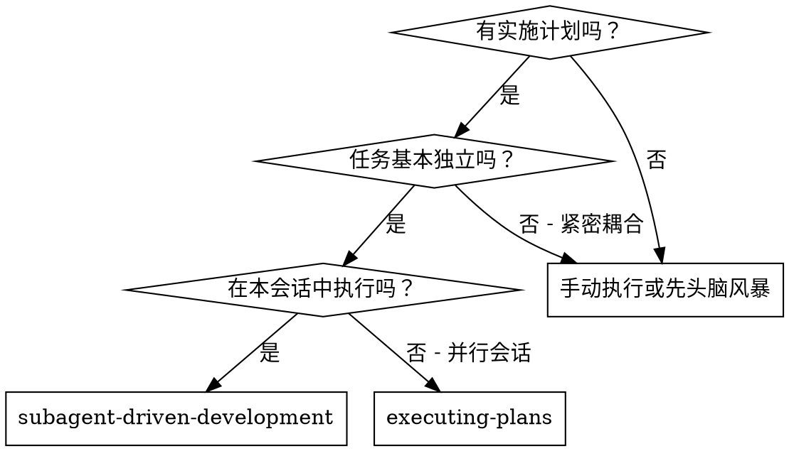
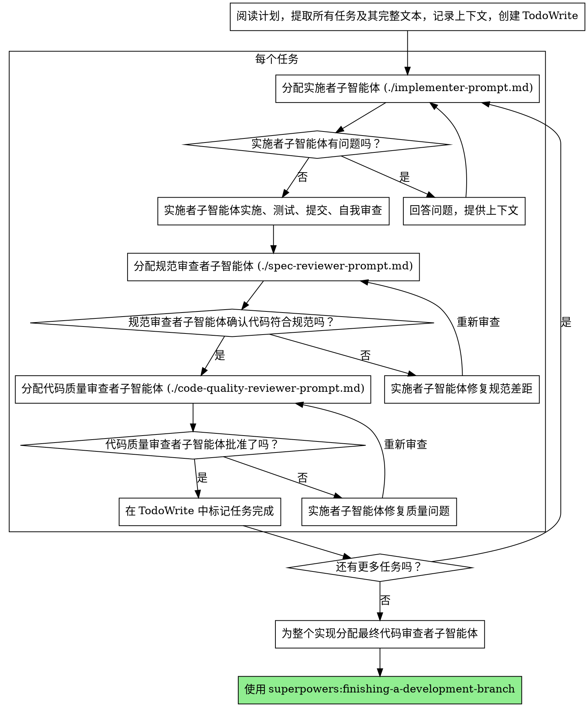

# 子智能体驱动开发

通过为每个任务分配新的子智能体来执行计划，每个任务完成后进行两阶段审查：首先审查规范合规性，然后审查代码质量。

**为什么使用子智能体：** 你将任务委托给具有独立上下文的专业化智能体。通过精确设计它们的指令和上下文，你可以确保它们保持专注并成功完成任务。它们永远不应该继承你的会话上下文或历史记录——你要精确构建它们所需的内容。这也保护了你自己的上下文用于协调工作。

**核心原则：** 每个任务一个全新的子智能体 + 两阶段审查（先规范合规，后代码质量）= 高质量、快速迭代

## 何时使用



**vs. 执行计划（并行会话）：**
- 同一会话（无上下文切换）
- 每个任务一个全新的子智能体（无上下文污染）
- 每个任务完成后两阶段审查：先规范合规，后代码质量
- 更快迭代（任务之间无需人工介入）

## 流程



## 模型选择

使用能处理每个角色所需的最低配模型，以节省成本并提高速度。

**机械性实施任务**（独立函数、清晰规范、1-2个文件）：使用快速、便宜的模型。当计划明确指定时，大多数实施任务是机械性的。

**集成和判断任务**（多文件协调、模式匹配、调试）：使用标准模型。

**架构、设计和审查任务**：使用最有能力的模型。

**任务复杂度信号：**
- 涉及1-2个文件且规范完整 → 便宜模型
- 涉及多个文件且有集成问题 → 标准模型
- 需要设计判断或广泛的代码库理解 → 最有能力的模型

## 处理实施者状态

实施者子智能体报告四种状态之一。相应处理：

**完成：** 进入规范合规审查。

**完成但有疑虑：** 实施者完成了工作但标记了疑虑。在继续之前阅读这些疑虑。如果疑虑涉及正确性或范围，先解决再审查。如果它们是观察性意见（例如"这个文件越来越大了"），记录下来并继续审查。

**需要上下文：** 实施者需要未提供的信息。提供缺失的上下文并重新分配。

**阻塞：** 实施者无法完成任务。评估阻塞原因：
1. 如果是上下文问题，提供更多上下文并用相同模型重新分配
2. 如果任务需要更多推理，用更有能力的模型重新分配
3. 如果任务太大，拆分成更小的部分
4. 如果计划本身有问题，升级给人工

**永远不要**忽略升级或在没有变更的情况下强制相同模型重试。如果实施者说卡住了，就需要改变。

## 提示模板

- `./implementer-prompt.md` - 分配实施者子智能体
- `./spec-reviewer-prompt.md` - 分配规范合规审查者子智能体
- `./code-quality-reviewer-prompt.md` - 分配代码质量审查者子智能体

## 示例工作流

```
你：我正在使用子智能体驱动开发来执行这个计划。

[阅读计划文件一次：docs/superpowers/plans/feature-plan.md]
[提取所有5个任务及其完整文本和上下文]
[创建包含所有任务的 TodoWrite]

任务1：Hook 安装脚本

[获取任务1文本和上下文（已提取）]
[分配实施子智能体，包含完整任务文本 + 上下文]

实施者："在我开始之前——hook应该安装在用户级别还是系统级别？"

你："用户级别（~/.config/superpowers/hooks/）"

实施者："明白了。开始实施..."
[稍后] 实施者：
  - 实现了 install-hook 命令
  - 添加了测试，5/5 通过
  - 自我审查：发现漏掉了 --force 参数，已添加
  - 提交

[分配规范合规审查者]
规范审查者：✅ 符合规范 - 满足所有要求，无多余内容

[获取 git SHA，分配代码质量审查者]
代码审查者：优点：测试覆盖率好，代码干净。问题：无。批准。

[标记任务1完成]

任务2：恢复模式

[获取任务2文本和上下文（已提取）]
[分配实施子智能体，包含完整任务文本 + 上下文]

实施者：[没有问题，继续]
实施者：
  - 添加了 verify/repair 模式
  - 8/8 测试通过
  - 自我审查：一切正常
  - 提交

[分配规范合规审查者]
规范审查者：❌ 问题：
  - 缺失：进度报告（规范说"每100项报告一次"）
  - 多余：添加了 --json 参数（未请求）

[实施者修复问题]
实施者：移除了 --json 参数，添加了进度报告

[规范审查者再次审查]
规范审查者：✅ 现在符合规范

[分配代码质量审查者]
代码审查者：优点：扎实。问题（重要）：魔术数字（100）

[实施者修复]
实施者：提取了 PROGRESS_INTERVAL 常量

[代码审查者再次审查]
代码审查者：✅ 批准

[标记任务2完成]

...

[所有任务完成后]
[分配最终代码审查者]
最终审查者：满足所有要求，可以合并

完成！
```

## 优势

**vs. 手动执行：**
- 子智能体自然遵循 TDD
- 每个任务上下文全新（无混淆）
- 并行安全（子智能体互不干扰）
- 子智能体可以提问（工作前和工作期间都可以）

**vs. 执行计划：**
- 同一会话（无交接）
- 持续进展（无需等待）
- 审查检查点自动

**效率提升：**
- 无文件读取开销（控制器提供完整文本）
- 控制器精确筛选所需上下文
- 子智能体获得完整的先验信息
- 问题在工作开始前浮出水面（而非之后）

**质量门控：**
- 自我审查在交接前发现问题
- 两阶段审查：规范合规，然后代码质量
- 审查循环确保修复真正有效
- 规范合规防止过度或不足构建
- 代码质量确保实现构建良好

**成本：**
- 更多的子智能体调用（每个任务实施者 + 2个审查者）
- 控制器做更多准备工作（预先提取所有任务）
- 审查循环增加迭代
- 但尽早发现问题（比后期调试更便宜）

## 红旗

**永远不要：**
- 未明确获得用户同意就在 main/master 分支开始实施
- 跳过审查（规范合规或代码质量）
- 在问题未修复的情况下继续
- 并行分配多个实施子智能体（冲突）
- 让子智能体阅读计划文件（改为提供完整文本）
- 跳过场景设置上下文（子智能体需要理解任务在整体中的位置）
- 忽略子智能体的问题（在让他们继续之前回答）
- 对规范合规接受"差不多就行"（规范审查者发现问题 = 未完成）
- 跳过审查循环（审查者发现问题 = 实施者修复 = 再次审查）
- 用实施者自我审查替代实际审查（两者都需要）
- **在规范合规审查通过 ✅ 之前开始代码质量审查**（顺序错误）
- 在任一审查有未解决问题时进入下一任务

**如果子智能体提问：**
- 清晰完整地回答
- 必要时提供额外上下文
- 不要催促他们进入实施

**如果审查者发现问题：**
- 由实施者（同一个子智能体）修复
- 审查者再次审查
- 重复直到批准
- 不要跳过重新审查

**如果子智能体任务失败：**
- 用具体指令分配修复子智能体
- 不要尝试手动修复（上下文污染）

## 集成

**必需的工作流技能：**
- **superpowers:using-git-worktrees** - 必需：在开始之前设置隔离工作区
- **superpowers:writing-plans** - 创建本技能执行的计划
- **superpowers:requesting-code-review** - 审查者子智能体的代码审查模板
- **superpowers:finishing-a-development-branch** - 所有任务完成后完成开发

**子智能体应使用：**
- **superpowers:test-driven-development** - 子智能体为每个任务遵循 TDD

**替代工作流：**
- **superpowers:executing-plans** - 用于并行会话而非同一会话执行
