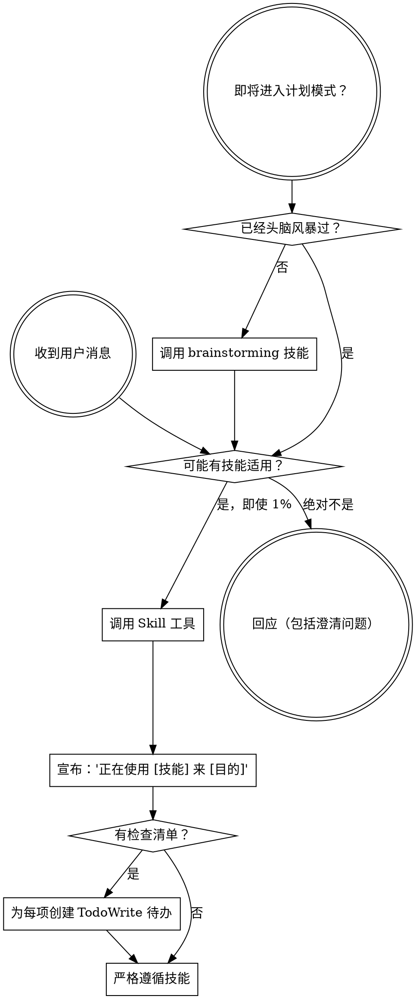

<SUBAGENT-STOP>
如果你被调度为子代理来执行特定任务，跳过此技能。
</SUBAGENT-STOP>

<EXTREMELY-IMPORTANT>
如果你认为某技能有哪怕 1% 的可能性适用于你正在做的事，你绝对必须调用该技能。

如果某技能适用于你的任务，你没有选择。你必须使用它。

这不容商量。这不是可选的。你无法通过理性化来绕过它。
</EXTREMELY-IMPORTANT>

## 指令优先级

Superpowers 技能覆盖默认系统提示行为，但**用户指令始终优先**：

1. **用户的明确指令**（CLAUDE.md、GEMINI.md、AGENTS.md、直接请求）—— 最高优先级
2. **Superpowers 技能** —— 在冲突处覆盖默认系统行为
3. **默认系统提示** —— 最低优先级

如果 CLAUDE.md、GEMINI.md 或 AGENTS.md 说"不要用 TDD"而某技能说"始终用 TDD"，遵循用户的指令。用户说了算。

## 如何访问技能

**在 Claude Code 中：** 使用 `Skill` 工具。当你调用某技能时，其内容被加载并呈现给你 —— 直接遵循它。永远不要用 Read 工具读取技能文件。

**在 Gemini CLI 中：** 技能通过 `activate_skill` 工具激活。Gemini 在会话开始时加载技能元数据并按需激活完整内容。

**在其他环境中：** 查看你的平台文档了解如何加载技能。

## 平台适配

技能使用 Claude Code 工具名称。非 CC 平台：参见 `references/codex-tools.md`（Codex）的工具等效项。Gemini CLI 用户通过 GEMINI.md 自动加载工具映射。

# 使用技能

## 规则

**在任何回应或行动之前调用相关或被请求的技能。** 哪怕有 1% 的可能性某技能适用，也应该调用它来检查。如果被调用的技能被证明不适合当前情况，你不需要使用它。

## 红旗

这些想法意味着停止 —— 你在合理化：

| 想法 | 现实 |
|---------|---------|
| "这只是一个简单的问题" | 问题就是任务。检查技能。 |
| "我需要先了解更多上下文" | 技能检查在澄清问题之前。 |
| "让我先探索代码库" | 技能告诉你如何探索。先检查。 |
| "我可以快速检查 git/文件" | 文件缺乏会话上下文。检查技能。 |
| "让我先收集信息" | 技能告诉你如何收集信息。 |
| "这不需要正式的技能" | 如果技能存在，就使用它。 |
| "我记得这个技能" | 技能会演进。阅读当前版本。 |
| "这不算任务" | 行动 = 任务。检查技能。 |
| "这个技能有点过度" | 简单的事会变复杂。使用它。 |
| "我先做这一件事" | 在做任何事之前检查。 |
| "这感觉很有成效" | 不纪律化的行动浪费时间。技能防止这一点。 |
| "我知道那是什么意思" | 知道概念 ≠ 使用技能。调用它。 |

## 技能优先级

当多个技能可能适用时，按此顺序：

1. **流程技能优先**（brainstorming、debugging）—— 这些决定如何处理任务
2. **实施技能其次**（frontend-design、mcp-builder）—— 这些指导执行

"让我们构建 X" → 先 brainstorming，再实施技能。
"修复这个 bug" → 先 debugging，再领域特定技能。

## 技能类型

**严格型**（TDD、debugging）：严格遵循。不要为了适应而偏离纪律。

**灵活型**（patterns）：根据上下文调整原则。

技能本身会告诉你属于哪种。

## 用户指令

指令说明 WHAT，而不是 HOW。"添加 X"或"修复 Y"并不意味着跳过工作流。
