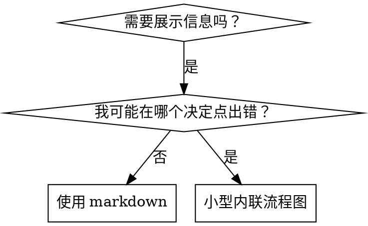

# 编写技能

## 概述

**编写技能就是将测试驱动开发应用于流程文档。**

**个人技能存放在智能体特定的目录中（Claude Code 用 `~/.claude/skills`，Codex 用 `~/.agents/skills/`）**

你编写测试用例（带子智能体的压力场景），观察它们失败（基线行为），编写技能（文档），观察测试通过（智能体遵从），然后重构（堵住漏洞）。

**核心原则：** 如果你没有亲眼看到智能体在没有技能的情况下失败，你就不知道这个技能教的是否正确。

**必需背景：** 在使用本技能之前，你必须理解 superpowers:test-driven-development。该技能定义了基本的红-绿-重构循环。本技能将 TDD 适配到文档领域。

**官方指导：** 关于 Anthropic 官方技能编写最佳实践，参见 anthropic-best-practices.md。本文档提供了补充 TDD 聚焦方法的额外模式和指南。

## 什么是技能？

**技能**是经过验证的技术、模式或工具的参考指南。技能帮助未来的 Claude 实例找到并应用有效方法。

**技能是：** 可复用技术、模式、工具、参考指南

**技能不是：** 关于你曾经如何一次性解决问题 的叙事

## 技能的 TDD 映射

| TDD 概念 | 技能创建 |
|---------|---------|
| **测试用例** | 带子智能体的压力场景 |
| **生产代码** | 技能文档（SKILL.md）|
| **测试失败（红）** | 无技能时智能体违反规则（基线）|
| **测试通过（绿）** | 有技能时智能体遵从（合规）|
| **重构** | 在保持合规的同时堵住漏洞 |
| **先写测试** | 编写技能前运行基线场景 |
| **观察失败** | 记录智能体使用的确切借口 |
| **最小代码** | 编写技能针对那些特定违规 |
| **观察通过** | 验证智能体现在遵从 |
| **重构循环** | 发现新借口 → 堵住 → 重新验证 |

整个技能创建过程遵循红-绿-重构。

## 何时创建技能

**创建时机：**
- 这项技术对你来说不是直观明显的
- 你会在多个项目中参考它
- 模式应用广泛（不是特定于项目的）
- 其他人也会受益

**不要为以下创建：**
- 一次性解决方案
- 在其他地方有充分文档记录的标准实践
- 特定于项目的约定（放在 CLAUDE.md 中）
- 机械约束（如果可以用正则/验证强制执行，就自动化——把文档留给需要判断的情况）

## 技能类型

### 技术（Technique）
具体方法，带有要遵循的步骤（condition-based-waiting，root-cause-tracing）

### 模式（Pattern）
思考问题的方式（flatten-with-flags，test-invariants）

### 参考（Reference）
API 文档、语法指南、工具文档（office docs）

## 目录结构


```
skills/
  skill-name/
    SKILL.md              # 主参考（必需）
    supporting-file.*     # 仅在需要时
```

**扁平命名空间** - 所有技能在一个可搜索的命名空间中

**单独文件的条件：**
1. **重型参考**（100+ 行）- API 文档、综合语法
2. **可复用工具** - 脚本、实用程序、模板

**保持内联：**
- 原则和概念
- 代码模式（< 50 行）
- 其他一切

## SKILL.md 结构

**前言（YAML）：**
- 两个必需字段：`name` 和 `description`（参见 [agentskills.io/specification](https://agentskills.io/specification) 了解所有支持的字段）
- 总计最多 1024 个字符
- `name`：仅使用字母、数字和连字符（无括号、特殊字符）
- `description`：第三人称，仅描述何时使用（不是做什么）
  - 以 "Use when..." 开始，聚焦触发条件
  - 包含具体症状、情况和上下文
  - **永远不要总结技能的过程或工作流**（参见 CSO 部分了解原因）
- 如果可能，保持在 500 个字符以下

```markdown
---
name: Skill-Name-With-Hyphens
description: Use when [specific triggering conditions and symptoms]
---

# Skill Name

## Overview
What is this? Core principle in 1-2 sentences.

## When to Use
[Small inline flowchart IF decision non-obvious]

Bullet list with SYMPTOMS and use cases
When NOT to use

## Core Pattern (for techniques/patterns)
Before/after code comparison

## Quick Reference
Table or bullets for scanning common operations

## Implementation
Inline code for simple patterns
Link to file for heavy reference or reusable tools

## Common Mistakes
What goes wrong + fixes

## Real-World Impact (optional)
Concrete results
```


## Claude 搜索优化（CSO）

**发现的关键：** 未来的 Claude 需要找到你的技能

### 1. 丰富的描述字段

**目的：** Claude 阅读描述来决定为给定任务加载哪些技能。让它回答："我现在应该读这个技能吗？"

**格式：** 以 "Use when..." 开始，聚焦触发条件

**关键：描述 = 何时使用，不是技能做什么**

描述应该只描述触发条件。不要在描述中总结技能的过程或工作流。

**为什么这很重要：** 测试揭示，当描述总结技能工作流时，Claude 可能会跟随描述而不是阅读完整的技能内容。说 "code review between tasks" 的描述导致 Claude 做了一次审查，即使技能流程图清楚显示有两次审查（规范合规然后代码质量）。

当描述改为只说 "Use when executing implementation plans with independent tasks"（无工作流总结）时，Claude 正确阅读了流程图并遵循了两阶段审查流程。

**陷阱：** 总结工作流的描述创造了一条 Claude 会走的捷径。技能正文变成了 Claude 跳过的文档。

```yaml
# ❌ 错误：总结工作流 - Claude 可能跟随这个而不是阅读技能
description: Use when executing plans - dispatches subagent per task with code review between tasks

# ❌ 错误：太多流程细节
description: Use for TDD - write test first, watch it fail, write minimal code, refactor

# ✅ 正确：只有触发条件，无工作流总结
description: Use when executing implementation plans with independent tasks in the current session

# ✅ 正确：只有触发条件
description: Use when implementing any feature or bugfix, before writing implementation code
```

**内容：**
- 使用具体触发器、症状和表明此技能适用的情境
- 描述*问题*（竞态条件、不一致行为）而非*语言特定症状*（setTimeout、sleep）
- 保持触发器技术无关，除非技能本身是技术特定的
- 如果技能是技术特定的，在触发器中明确说明
- 用第三人称书写（注入到系统提示中）
- **永远不要总结技能的过程或工作流**

```yaml
# ❌ 错误：太抽象、模糊、没有包含何时使用
description: For async testing

# ❌ 错误：第一人称
description: I can help you with async tests when they're flaky

# ❌ 错误：提到技术但技能并不特定于该技术
description: Use when tests use setTimeout/sleep and are flaky

# ✅ 正确：以 "Use when" 开头，描述问题，无工作流
description: Use when tests have race conditions, timing dependencies, or pass/fail inconsistently

# ✅ 正确：技术特定的技能，有明确触发器
description: Use when using React Router and handling authentication redirects
```

### 2. 关键词覆盖

使用 Claude 会搜索的词：
- 错误消息："Hook timed out"、"ENOTEMPTY"、"race condition"
- 症状："flaky"、"hanging"、"zombie"、"pollution"
- 同义词："timeout/hang/freeze"、"cleanup/teardown/afterEach"
- 工具：实际命令、库名、文件类型

### 3. 描述性命名

**使用主动语态，动词优先：**
- ✅ `creating-skills` 不是 `skill-creation`
- ✅ `condition-based-waiting` 不是 `async-test-helpers`

### 4. Token 效率（关键）

**问题：** getting-started 和频繁引用的技能加载到每个对话中。每个 token 都重要。

**目标字数：**
- getting-started 工作流：每个 <150 词
- 频繁加载的技能：总计 <200 词
- 其他技能：<500 词（仍然要简洁）

**技术：**

**将细节移到工具帮助中：**
```bash
# ❌ 错误：在 SKILL.md 中记录所有参数
search-conversations 支持 --text、--both、--after DATE、--before DATE、--limit N

# ✅ 正确：参考 --help
search-conversations 支持多种模式和过滤器。运行 --help 查看详情。
```

**使用交叉引用：**
```markdown
# ❌ 错误：重复工作流细节
搜索时，用模板分配子智能体...
[20 行重复指令]

# ✅ 正确：引用其他技能
始终使用子智能体（节省 50-100x 上下文）。必需：使用 [other-skill-name] 了解工作流。
```

**压缩示例：**
```markdown
# ❌ 错误：冗长示例（42 词）
搭档："在 React Router 之前我们如何处理认证错误？"
你："我会搜索过去的对话中 React Router 认证模式。"
[分配带搜索查询的子智能体："React Router 认证错误处理 401"]

# ✅ 正确：最小示例（20 词）
搭档："我们在 React Router 中如何处理认证错误？"
你：搜索中...
[分配子智能体 → 综合]
```

**消除冗余：**
- 不要重复交叉引用技能中的内容
- 不要解释命令中显而易见的内容
- 不要包含同一模式的多个示例

**验证：**
```bash
wc -w skills/path/SKILL.md
# getting-started 工作流：目标 <150 每条
# 其他频繁加载：目标 <200 总计
```

**按你做的或核心洞察命名：**
- ✅ `condition-based-waiting` > `async-test-helpers`
- ✅ `using-skills` 不是 `skill-usage`
- ✅ `flatten-with-flags` > `data-structure-refactoring`
- ✅ `root-cause-tracing` > `debugging-techniques`

**动名词（-ing）适合流程：**
- `creating-skills`、`testing-skills`、`debugging-with-logs`
- 主动，描述你采取的行动

### 4. 交叉引用其他技能

**编写引用其他技能的文档时：**

仅使用技能名称，带明确的必需标记：
- ✅ 好：`**REQUIRED SUB-SKILL:** Use superpowers:test-driven-development`
- ✅ 好：`**REQUIRED BACKGROUND:** You MUST understand superpowers:systematic-debugging`
- ❌ 坏：`See skills/testing/test-driven-development`（不清楚是否必需）
- ❌ 坏：`@skills/testing/test-driven-development/SKILL.md`（强制加载，消耗上下文）

**为什么不用 @ 链接：** @ 语法会立即强制加载文件，在你需要之前消耗 200k+ 上下文。

## 流程图使用



**仅在以下情况使用流程图：**
- 非显而易见的决策点
- 你可能过早停止的过程循环
- "何时使用 A vs B" 的决策

**永远不要为以下使用流程图：**
- 参考资料 → 表格、列表
- 代码示例 → Markdown 代码块
- 线性指令 → 编号列表
- 无语义意义的标签（step1、helper2）

参见 @graphviz-conventions.dot 了解 graphviz 样式规则。

**为你的搭档可视化：** 使用本目录中的 `render-graphs.js` 将技能流程图渲染为 SVG：
```bash
./render-graphs.js ../some-skill           # 每个图单独渲染
./render-graphs.js ../some-skill --combine # 所有图合并为一个 SVG
```

## 代码示例

**一个优秀示例胜过许多平庸示例**

选择最相关的语言：
- 测试技术 → TypeScript/JavaScript
- 系统调试 → Shell/Python
- 数据处理 → Python

**好示例：**
- 完整且可运行
- 注释良好，解释为什么
- 来自真实场景
- 清晰展示模式
- 易于适配（不是通用模板）

**不要：**
- 用 5+ 种语言实现
- 创建填空模板
- 写 contrived 示例

你擅长移植——一个优秀的示例就够了。

## 文件组织

### 自包含技能
```
defense-in-depth/
  SKILL.md    # 一切内联
```
适用：当所有内容都放得下，不需要重型参考

### 带可复用工具的技能
```
condition-based-waiting/
  SKILL.md    # 概述 + 模式
  example.ts  # 可适配的工作辅助函数
```
适用：工具是可复用代码，不只是叙事

### 带重型参考的技能
```
pptx/
  SKILL.md       # 概述 + 工作流
  pptxgenjs.md   # 600 行 API 参考
  ooxml.md       # 500 行 XML 结构
  scripts/       # 可执行工具
```
适用：参考材料太大无法内联

## 铁律（与 TDD 相同）

```
没有失败的测试就不能有技能
```

这适用于新技能和现有技能的编辑。

写技能前测试？删除它。重头来。
编辑技能不测试？同样违反规则。

**没有例外：**
- 不是因为"简单添加"
- 不是因为"只是加一节"
- 不是因为"文档更新"
- 不要保留未测试的更改作为"参考"
- 不要在运行测试时"适配"
- 删除就是删除

**必需背景：** superpowers:test-driven-development 技能解释了为什么这很重要。相同的原则适用于文档。

## 测试所有技能类型

不同的技能类型需要不同的测试方法：

### 纪律强制技能（规则/要求）

**示例：** TDD、完成前验证、设计前编码

**测试方法：**
- 学术问题：他们理解规则吗？
- 压力场景：他们在压力下遵从吗？
- 多重压力组合：时间 + 沉没成本 + 疲劳
- 识别借口并添加明确的反驳

**成功标准：** 智能体在最大压力下遵循规则

### 技术技能（操作指南）

**示例：** condition-based-waiting、root-cause-tracing、defensive-programming

**测试方法：**
- 应用场景：他们能正确应用技术吗？
- 变体场景：他们处理边界情况吗？
- 缺失信息测试：说明有漏洞吗？

**成功标准：** 智能体成功将技术应用于新场景

### 模式技能（心智模型）

**示例：** reducing-complexity、information-hiding concepts

**测试方法：**
- 识别场景：他们认识到模式何时适用吗？
- 应用场景：他们能使用心智模型吗？
- 反例：他们知道何时不应用吗？

**成功标准：** 智能体正确识别何时/如何应用模式

### 参考技能（文档/API）

**示例：** API 文档、命令参考、库指南

**测试方法：**
- 检索场景：他们能找到正确信息吗？
- 应用场景：他们能正确使用找到的内容吗？
- 漏洞测试：常见用例被覆盖了吗？

**成功标准：** 智能体找到并正确应用参考信息

## 跳过测试的常见借口

| 借口 | 现实 |
|--------|---------|
| "技能显然很清楚" | 你清楚 ≠ 其他智能体清楚。测试它。 |
| "只是参考而已" | 参考可能有漏洞、不清楚的部分。测试检索。 |
| "测试太过度了" | 未测试的技能有问题。每次都是。15分钟测试节省数小时。 |
| "如果出问题再测试" | 问题 = 智能体无法使用技能。部署前测试。 |
| "太乏味了不想测" | 测试比在生产中调试坏技能更不乏味。 |
| "我确信它很好" | 过度自信保证出问题。还是要测试。 |
| "学术审查就够了" | 阅读 ≠ 使用。测试应用场景。 |
| "没时间测试" | 部署未测试的技能会浪费更多时间稍后修复。 |

**所有这些意思是：部署前测试。没有例外。**

## 防止借口强化技能

强制纪律的技能（如 TDD）需要抵御借口。智能体很聪明，在压力下会找漏洞。

**心理学笔记：** 理解为什么说服技术有效帮助你系统地应用它们。参见 persuasion-principles.md 了解研究基础（Cialdini，2021；Meincke 等，2025）关于权威、承诺、稀缺、社会认同和统一原则。

### 明确堵住每个漏洞

不要只陈述规则——禁止具体变通方案：

<坏>
```markdown
测试前写代码？删除它。
```
</坏>

<好>
```markdown
测试前写代码？删除它。重头来。

**没有例外：**
- 不要保留作为"参考"
- 不要在写测试时"适配"
- 不要看它
- 删除就是删除
```
</好>

### 解决"精神 vs 字面"争论

尽早添加基本原则：

```markdown
**违反规则的字面就是违反规则的精神。**
```

这切断了一整类"我在遵循精神"的借口。

### 构建借口表

从基线测试中捕获借口（参见下面的测试部分）。智能体提出的每个借口都放入表中：

```markdown
| 借口 | 现实 |
|--------|---------|
| "太简单不需要测试" | 简单代码也会坏。测试只需30秒。 |
| "我之后测试" | 测试立即通过什么都证明不了。 |
| "之后测试也能达到同样目标" | 后测 = "这是做什么的？" 先测 = "这应该做什么？" |
```

### 创建红旗列表

让智能体在找借口时容易自我检查：

```markdown
## 红旗 - 停止并重头来

- 测试前写代码
- "我已经手动测试过了"
- "之后测试也能达到同样目的"
- "这是精神不是仪式"
- "这不一样因为..."

**所有这些意思是：删除代码。从 TDD 重头来。**
```

### 更新 CSO 的违规症状

添加到描述中：你即将违反规则时的症状：

```yaml
description: use when implementing any feature or bugfix, before writing implementation code
```

## 技能的红-绿-重构

遵循 TDD 循环：

### 红：写失败的测试（基线）

在无技能的情况下，用子智能体运行压力场景。记录确切行为：
- 他们做了什么选择？
- 他们使用了什么借口（原文）？
- 哪些压力触发了违规？

这就是"观察测试失败"——你必须看到智能体自然做什么，然后才能写技能。

### 绿：写最小技能

写技能针对那些特定借口。不要为假设情况添加额外内容。

用技能运行相同场景。智能体现在应该遵从。

### 重构：堵住漏洞

智能体发现了新借口？添加明确的反驳。重新测试直到无懈可击。

**测试方法论：** 参见 @testing-skills-with-subagents.md 了解完整测试方法：
- 如何编写压力场景
- 压力类型（时间、沉没成本、权威、疲劳）
- 系统堵洞
- 元测试技术

## 反模式

### ❌ 叙事示例
"在 2025-10-03 的会话中，我们发现空的 projectDir 导致..."
**为什么坏：** 太特定，不可复用

### ❌ 多语言稀释
example-js.js、example-py.py、example-go.go
**为什么坏：** 质量平庸，维护负担

### ❌ 流程图中的代码
```dot
step1 [label="import fs"];
step2 [label="read file"];
```
**为什么坏：** 不能复制粘贴，难读

### ❌ 通用标签
helper1、helper2、step3、pattern4
**为什么坏：** 标签应该有语义意义

## 停止：在进入下一个技能之前

**编写任何技能后，你必须停止并完成部署流程。**

**不要：**
- 批量创建多个技能而不测试每个
- 在当前技能未验证之前进入下一个
- 因为"批量更高效"而跳过测试

**以下部署清单对每个技能都是必需的。**

部署未测试的技能 = 部署未测试的代码。违反质量标准。

## 技能创建清单（TDD 适配版）

**重要：使用 TodoWrite 为以下每个清单项创建待办事项。**

**红阶段 - 写失败的测试：**
- [ ] 创建压力场景（纪律技能用 3+ 组合压力）
- [ ] 在无技能的情况下运行场景 - 原文记录基线行为
- [ ] 识别借口/失败的模式

**绿阶段 - 写最小技能：**
- [ ] 名称仅使用字母、数字、连字符（无括号/特殊字符）
- [ ] YAML 前言包含必需的 `name` 和 `description` 字段（最多 1024 字符；参见 [规范](https://agentskills.io/specification)）
- [ ] 描述以 "Use when..." 开头，包含具体触发器/症状
- [ ] 描述用第三人称
- [ ] 全文使用关键词便于搜索（错误、症状、工具）
- [ ] 有清晰的核心原则概述
- [ ] 针对红阶段识别的具体基线失败
- [ ] 代码内联或链接到单独文件
- [ ] 一个优秀示例（不是多语言）
- [ ] 用技能运行场景 - 验证智能体现在遵从

**重构阶段 - 堵住漏洞：**
- [ ] 从测试中识别新的借口
- [ ] 添加明确反驳（如果是纪律技能）
- [ ] 从所有测试迭代构建借口表
- [ ] 创建红旗列表
- [ ] 重新测试直到无懈可击

**质量检查：**
- [ ] 仅在决策非显而易见时使用小型流程图
- [ ] 快速参考表
- [ ] 常见错误部分
- [ ] 无叙事讲故事
- [ ] 仅工具或重型参考用支持文件

**部署：**
- [ ] 将技能提交到 git 并推送到你的 fork（如已配置）
- [ ] 如有广泛用途，考虑贡献回 PR

## 发现工作流

未来 Claude 如何找到你的技能：

1. **遇到问题**（"测试 flaky"）
3. **找到技能**（描述匹配）
4. **扫描概述**（这相关吗？）
5. **阅读模式**（快速参考表）
6. **加载示例**（仅在实现时）

**为此优化** - 将可搜索词早早且频繁放置。

## 底线

**创建技能就是流程文档的 TDD。**

同样的铁律：没有失败的测试就不能有技能。
同样的循环：红（基线）→ 绿（写技能）→ 重构（堵洞）。
同样好处：更高质量、更少意外、无懈可击的结果。

如果你为代码遵循 TDD，也为技能遵循。这是应用于文档的相同纪律。
